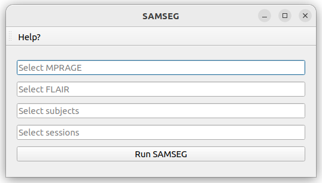
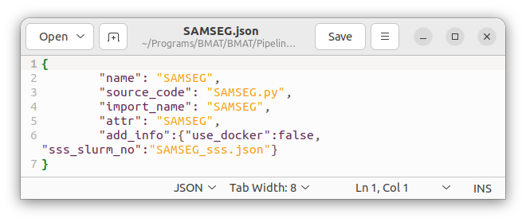

# samseg
Brain White Matter Lesion segmentation pipeline using SAMSEG

## Requirements

**FreeSurfer**
Either FreeSurfer already installed on the user's computer

Or using the docker freesurfer:7.3.2 

You can choose which one to run by switching the option in the SAMSEG.json file

## How to cite
1. Cerri S, Puonti O, Meier DS, Wuerfel J, Mühlau M, Siebner HR, et al. A contrast-adaptive method for simultaneous whole-brain and lesion segmentation in multiple sclerosis. NeuroImage. 2021 Jan 15;225:117471. 

2. Fischl B, Salat DH, Busa E, Albert M, Dieterich M, Haselgrove C, et al. Whole Brain Segmentation: Automated Labeling of Neuroanatomical Structures in the Human Brain. Neuron. 2002 Jan 31;33(3):341–55. 

## Utilization

The first figure below shows the window of this pipeline. This window contains the following information:

* "Select MPRAGE": name of the MPRAGE sequence in the anat folder to use for the segmentation

* "Select FLAIR": name of the FLAIR sequence in the anat folder to use for the segmentation

* "Select subjects" input: allows the user to script the automatic segmentation for subjects of the dataset by adding a list BIDS ID (without "sub-") separated by a comma. Possible values are: single BIDS ID (e.g. "001,002,006,013"), multiple folowing BIDS ID (e.g. "001-005" is the same as '001,002,003,004,005"), or all subjects ("all").

* "Select sessions" input: allows the user to script the automatic segmentation for sessions of subjects of the dataset by adding a list session ID (without "ses-") separated by a comma. Possible values are: single session ID (e.g. "01,02,06,13"), multiple folowing session ID (e.g. "01-05" is the same as '01,02,03,04,05"), or all sessions ("all").

* "Run SAMSEG" button: launch the automatic segmentaion based on all information given by the user

*Typically, a segmentation takes about 20 minutes*

## Change pipeline option

In the SAMSEG.json file, the user can choose some option to run SAMEG:

* "use_docker": choose to run the pipeline locally using the docker image (true) or locally installed FreeSurfer (default: false)

* "sss_slurm": precise the config file to run the pipeline on the SSS server (specific to UCLouvain members). If this tag does not exists (by default: "sss_slurm_no"), it will run the pipeline locally. To use this pipeline on remote server, change the name "sss_slurm_no" to "sss_slurm", and adapt the config file "SAMSEG_sss.json" for your specific slurm need. This works with a correct "server_info.json" config file in the BMAT home directory.

